# 微信公众号咖啡猫编辑

把中文微信公众号初稿整理成可直接复制进微信编辑器的精排 HTML，并生成 2.35:1 微信封面和 Ian 风格咖啡猫正文配图。

设计者：Rinkon

## 这个 Skill 做什么

- 将 Markdown、纯文本、newsletter 初稿或来源页改写成完整公众号文章。
- 自动提炼标题、导语、核心判断、编号章节、总结和可选引用。
- 生成兼容微信公众号编辑器的内联样式 HTML。
- 为每篇文章规划并生成一张必需的 2.35:1 微信封面。
- 内置 Ian 风格咖啡猫手绘解释图系统，用于正文关键概念配图。
- 自动识别来源、作者、链接、参考资料等引用信号；没有来源时直接省略引用部分。

## 适合什么场景

- 你有一篇公众号草稿，希望它更像一篇完成稿，而不是资料堆。
- 你有一个网页、案例页、产品页或报告，希望改写成适合微信阅读的文章。
- 你希望文章自带封面图、正文解释配图和可直接复制的 HTML。
- 你想稳定复用一种黑白灰、少量红橙蓝批注的咖啡猫手绘正文配图风格。

## 插图预览

下面这些图是内置的咖啡猫风格参考，用来展示线条密度、留白、标注节奏和咖啡猫参与概念工作的方式。

| | |
|---|---|
| 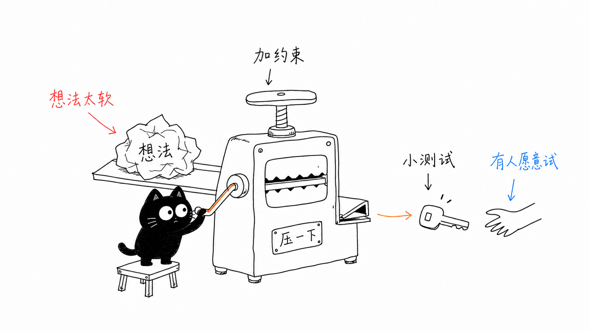 | 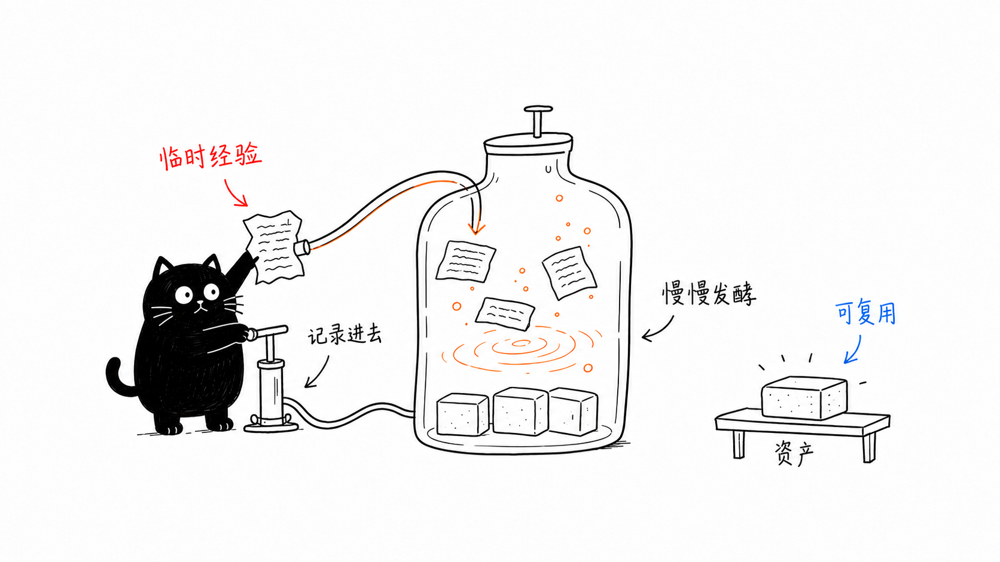 |
| 压缩想法 | 内容发酵 |
| 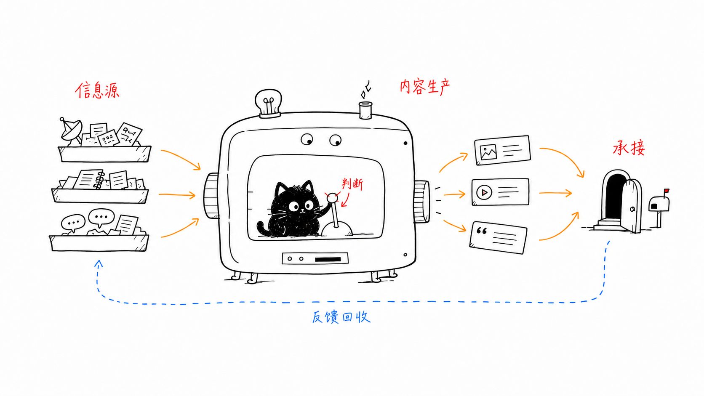 | 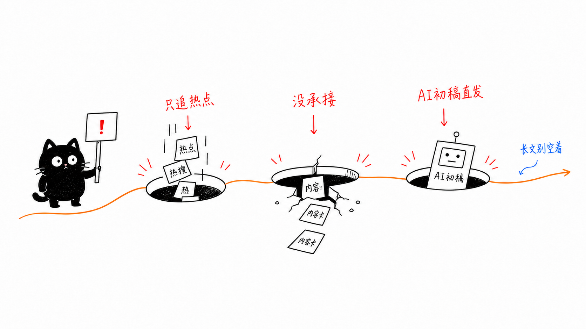 |
| 内容机器反馈 | 内容常见坑 |
| 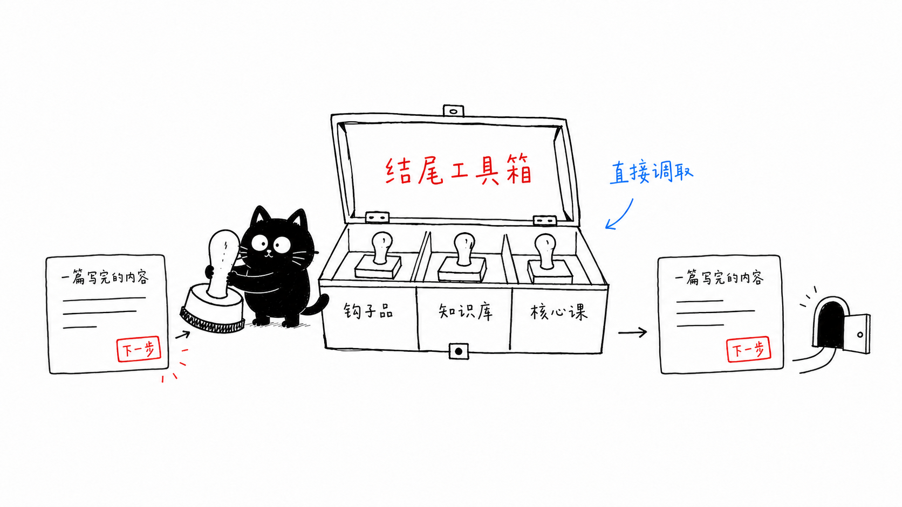 | 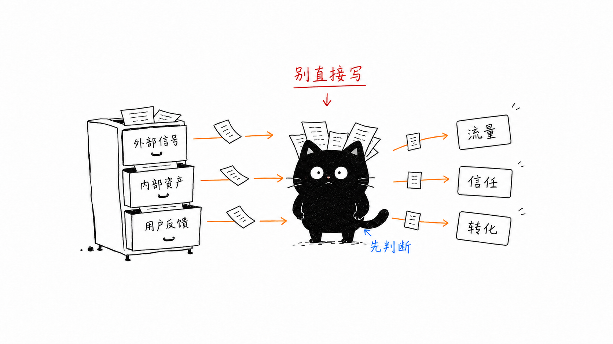 |
| 结尾工具箱 | 过滤信号 |
| 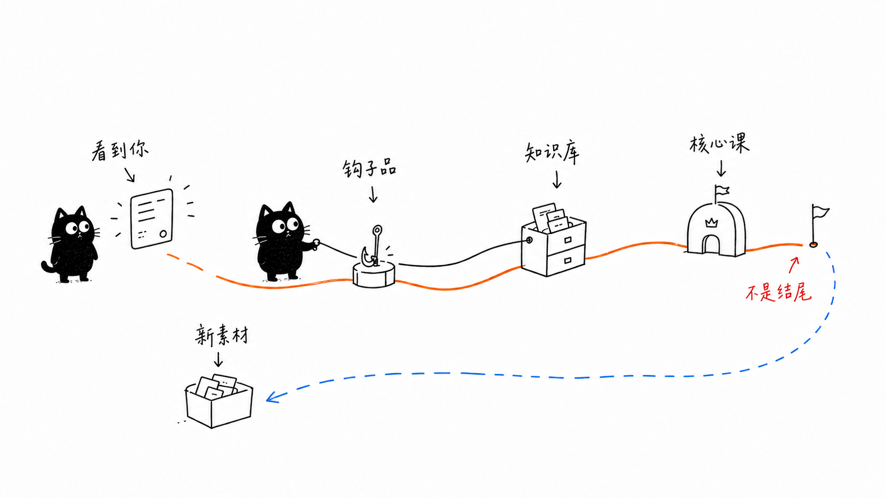 | 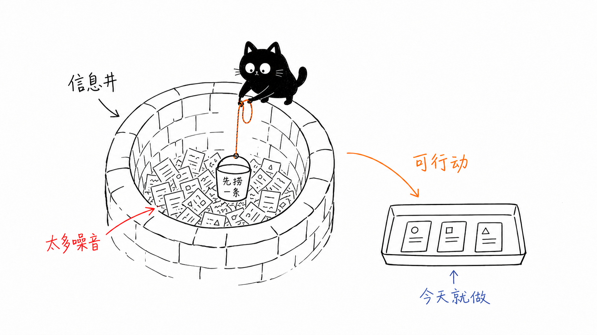 |
| 钩子到知识核心 | 信息井 |
| 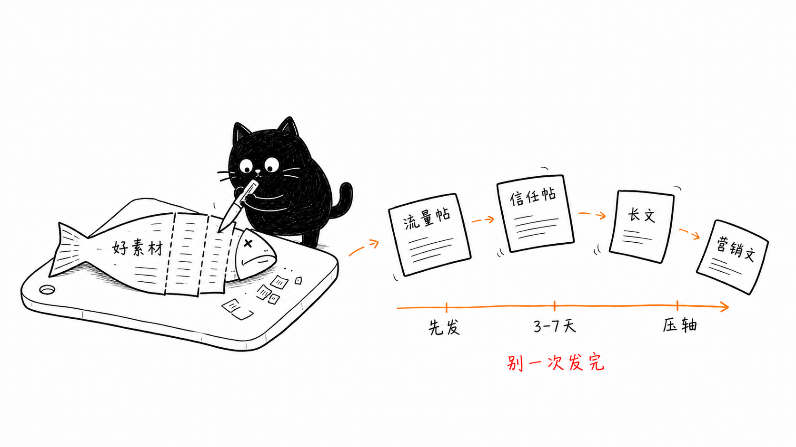 | 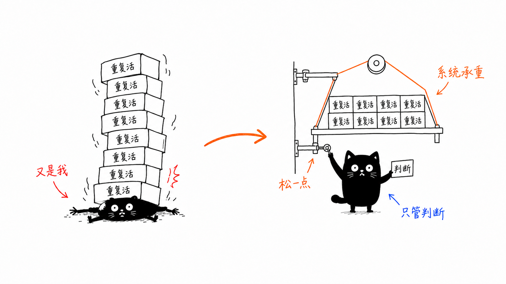 |
| 一鱼多用 | 系统承重 |
| 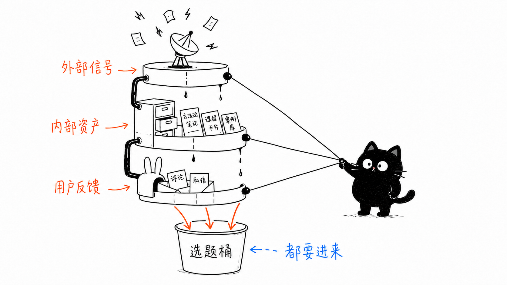 | 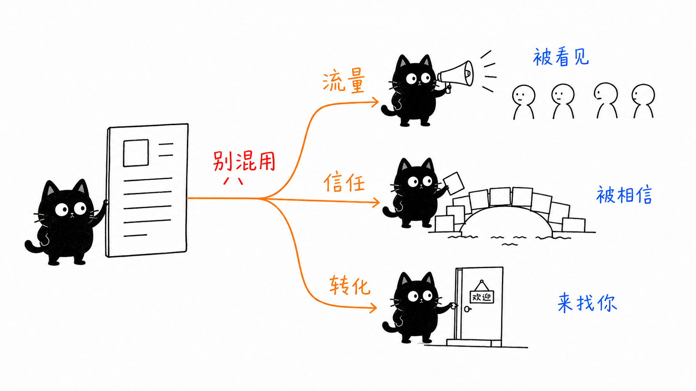 |
| 主题漏斗 | 流量信任转化 |
| 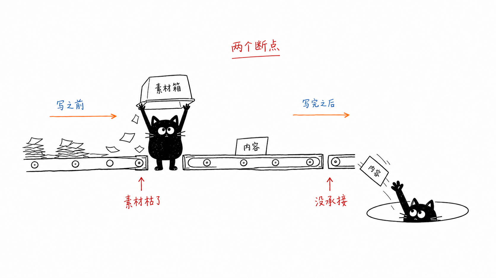 |  |
| 两个断点 |  |

## 不适合什么场景

- 只想做普通 Markdown 清理，不需要编辑改写和微信排版。
- 想生成商业海报、品牌 KV、复杂 PPT 信息图或正式系统架构图。
- 想把大量正文、长段说明或完整课程页塞进一张图片里。

## 安装

克隆这个仓库，然后把里面的 Skill 目录复制到 Codex skills 目录：

```bash
git clone https://github.com/Rinkon2046/wechat-kafei-cat-editor.git
mkdir -p ~/.codex/skills
cp -R wechat-kafei-cat-editor/wechat-kafei-cat-editor ~/.codex/skills/
```

安装后重启 Codex。

也可以用 Skills CLI 安装：

```bash
npx skills add https://github.com/Rinkon2046/wechat-kafei-cat-editor/tree/main/wechat-kafei-cat-editor -g -a codex -y
```

## 使用方式

在 Codex 里可以这样说：

```text
用 $wechat-kafei-cat-editor 把这篇初稿整理成微信公众号文章，生成 2.35:1 封面、正文咖啡猫配图和可复制 HTML。
```

也可以用于来源页改写：

```text
用 $wechat-kafei-cat-editor 改写这个来源页。不要照搬官网结构，压缩宣传模块，把它整理成适合公众号阅读的 3-5 个章节，并生成封面、正文配图和可复制 HTML。
```

## 仓库结构

```text
.
├── README.md
├── examples/
│   ├── prompts.md
│   └── images/
├── wechat-kafei-cat-editor/
│   ├── SKILL.md
│   ├── agents/
│   ├── assets/
│   └── scripts/
├── NOTICE.md
└── LICENSE
```

真正可安装的 Skill 是嵌套的 `wechat-kafei-cat-editor/` 目录。

## 默认产出

这个 Skill 通常会产出：

- 一份微信公众号可用的完整 HTML
- 一份方便复制到编辑器的 section-only HTML 片段
- 一张 2.35:1 微信封面 PNG
- 多张正文咖啡猫配图 PNG
- 一份图片插入位置表

## 注意事项

`wechat-kafei-cat-editor/assets/` 里的图片主要用于风格参考和示例展示。真实文章生成时，应该基于当前文章重新设计隐喻和图片提示词，而不是直接复用示例图作为最终配图。

图片里的中文标注越短越稳定。咖啡猫必须参与核心动作，而不是站在角落里做装饰。
